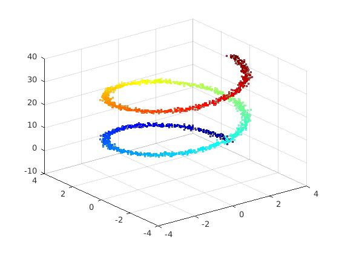
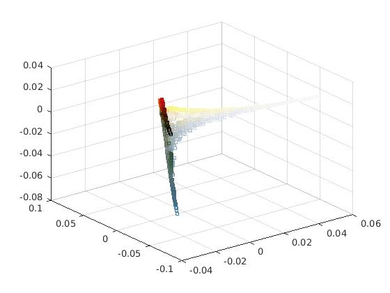
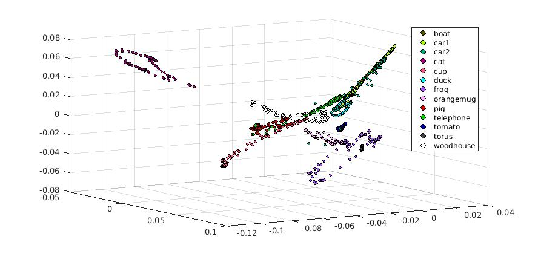

# local_tangent_space_alignment
LTSA, in MATLAB. Like LLE, LTSA is for nonlinear dimension reduction. But, LTSA is a method that constructs a principal manifold.

A principle manifold, a nonlinear mapping from one euclidean space to another. It's very interesting.

For example, given a spiral with gaussian noise we may want to find a 1d curve that describes it.

These are the coordinates that were found using LTSA, compared with the [0,1] interval.

So, using the same image as for the LLE example, we find this embedding with LTSA:

And finally, using 13 categories from the COIL-100 dataset, I apply this algorithm with k=100 and receive the following alignment:

